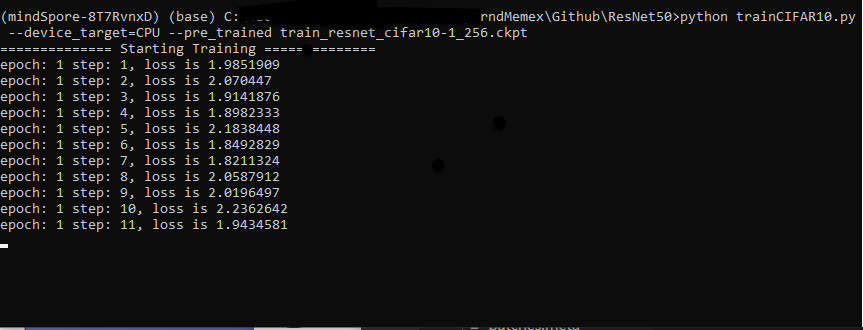

# ResNet50

This folder contains a ResNet model for Image Classification using CIFAR-10 dataset. ResNet50 is convolutional neural network 50 layers deep.


## Requirments

In order to use MindSpore, Windows-x64 is required. Python 3.7.5 must be installed, you can find how to do so [here](https://www.python.org/downloads/release/python-375/). 
For this project we have created a virtual environment local to this repository. This code has been implemented for --divice_target=CPU.


## Folder Structure

Place your test and training files within the `CIFAR-10` folder, the path has been specified within the code therefore it is important to place the target files in the right location.

```
CIFAR-10
   ├─cifar-10-batches-bin
   │
   └─cifar-10-verify-bin

```
Download the dataset from [CIFAR-10](http://www.cs.toronto.edu/~kriz/cifar.html). 

If you are using linux  simply use the command:

```
wget https://www.cs.toronto.edu/~kriz/cifar-10-binary.tar.gz
```

and 


```
tar -zvxf cifar-10-binary.tar.gz
```

Once downloaded save your file such that your CIFAR-10 folder will look like the following


```
CIFAR-10
   ├─cifar-10-batches-bin
   │            │  
   │            │─batches.meta
   │            │─ data_batch_1.bin
   │            │─ data_batch_2.bin
   │            │─ data_batch_3.bin
   │            │─ data_batch_4.bin
   │            │─ data_batch_5.bin
   │
   │
   └─cifar-10-verify-bin
             │  
             │─batches.meta
             │─ data_batch_1.bin
             │─ data_batch_2.bin
             │─ data_batch_3.bin
             │─ data_batch_4.bin
             │─ data_batch_5.bin
             │─ test_batch.bin
             
    
   
   
```
### Create a Virtual Env for Python 3.7 with virtualenv

- Install `pyenv`

- install  `pipenv` using `pip install  pipenv` or `pip install -user pipenv`
- navigate to the project directory, in this case ./mindSpore and use the following command:

```
pipenv install --python 3.7
```

now you may follow the instruction to activate your virtual environment. 

### Install MindSpore

To install MindSpore, follow the installation guide [here](https://www.mindspore.cn/install/en). Select your machine specifications to obtain the correct command. 
 
 # Usage

 ## Training
 
 
 ```
 python trainCIFAR10.py --device_target=CPU  --pre_trained=[CHECKPOINT_PATH](optional)
 ```
 The configuration requirments are the following:
 ```
     "class_num": 10,
     "batch_size": 32,
     "loss_scale": 1024,
     "momentum": 0.9,
     "weight_decay": 1e-4,
     "epoch_size": 90,
     "pretrain_epoch_size": 0,
     "save_checkpoint": True,
     "save_checkpoint_epochs": 5,
     "keep_checkpoint_max": 10,
     "save_checkpoint_path": "./",
     "warmup_epochs": 5,
     "lr_decay_mode": "poly",
     "lr_init": 0.01,
     "lr_end": 0.00001,
     "lr_max": 0.1
 
 ```
 
 

 ## Evaluation


 ```
 python evalCIFAR10.py --device_target=CPU  --checkpoint_path=[CHECKPOINT_PATH]
 ```
